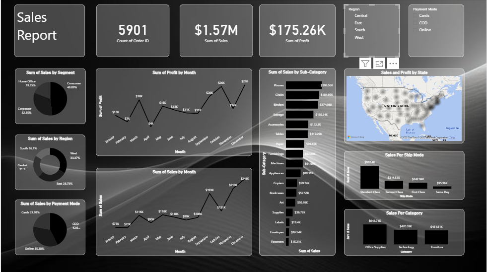

# Sales-Report-Power-BI
## 📊 Sales Report Dashboard

This project presents a comprehensive **Sales Report Dashboard** built to visualize and analyze sales performance across multiple dimensions. It includes interactive charts, filters, and summary panels that help stakeholders make data-driven decisions.

---

### 📌 Overview

The dashboard provides insights into:

- Total Orders: **5901**
- Total Sales: **$1.57M**
- Total Profit: **$175.26K**

It breaks down sales and profit across:

- Segments (Consumer, Corporate, Home Office)
- Regions (Central, East, South, West)
- Payment Methods (Credit Card, Cash, COD)
- Months and Trends
- Sub-Categories and Categories
- States and Ship Modes

---

### 📈 Visuals Included

| Visualization                        | Description                                      |
|-------------------------------------|--------------------------------------------------|
| Sales by Segment                    | Bar chart showing performance by customer type   |
| Profit by Month                     | Line chart tracking monthly profit trends        |
| Sales by Region                     | Regional breakdown of total sales                |
| Sales by Payment Method             | Comparison of payment types                      |
| Sales by Month                      | Monthly sales trend analysis                     |
| Sales by Sub-Category               | Detailed view of product sub-categories          |
| Sales by State                      | US map showing state-wise sales distribution     |
| Sales by Ship Mode                  | Performance by shipping method                   |
| Sales by Category                   | Overview of main product categories              |

---

### 🎛️ Filters

Users can interact with the dashboard using:

- **Region Filter**: Central, East, South, West  
- **Payment Mode Filter**: Credit Card, Cash, COD, Online  

These filters allow dynamic exploration of the data.

---

### 🛠️ Technologies Used

- **Power BI** for dashboard design and interactivity  
- **DAX** for calculated columns and measures  
- **Data Modeling** for relationships and performance optimization  

---

هل تحب أضيف ترجمة عربية للنسخة دي؟ أو تحب أضيف جزء عن كيفية تحميل البيانات أو ربطها؟
